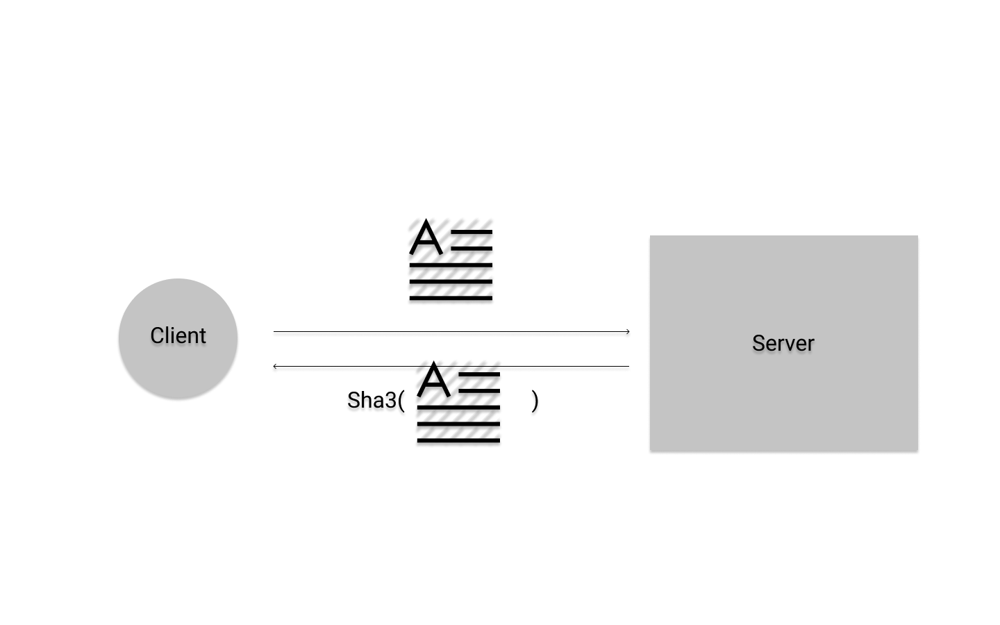
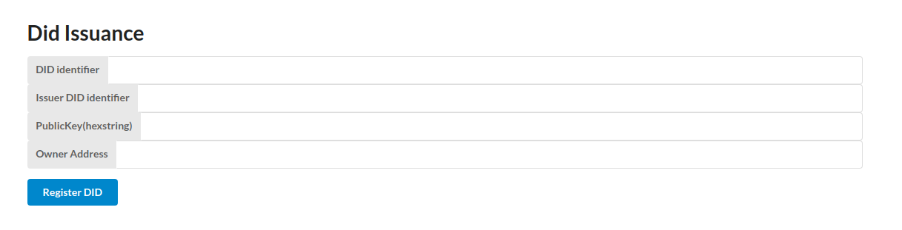
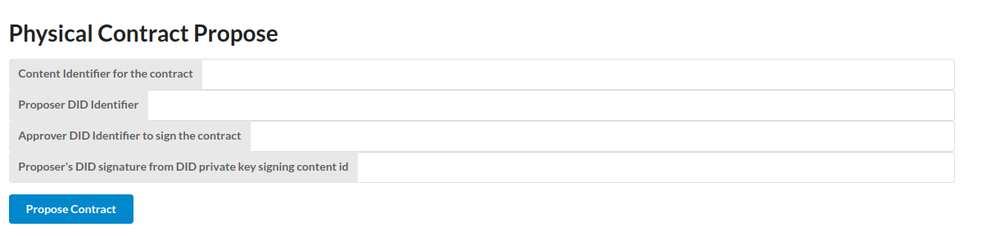
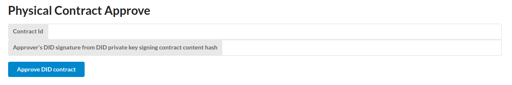
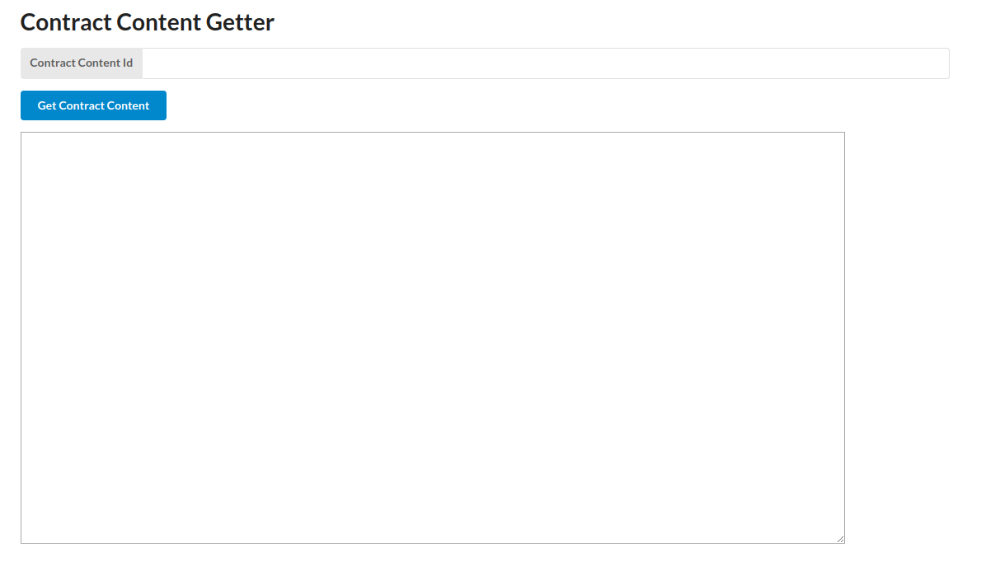
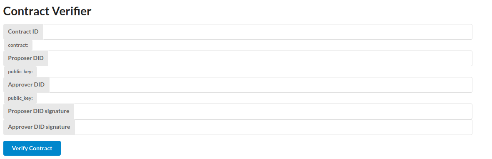

# Setup

The project consists of three components

1. Contract storage server
2. Substrate testnet(Private permissionless network)
3. Contract Verifier

# Contract storage server

Contract storage server is a [python code](./frontend-rs/server/file_server.py) that store the received text and returns sha3 hash of the content.



The contract file will be stored in `/project/api_uploaded_files`

To check the document content, `cd /project/api_uploaded_files` and browse with your terminal.

To submit the contract, use Postman and submit POST request just like the picture below.

[](./images/contract_submit.png)

# Substrate testnet

To run solo chain, you must build your binary and execute it.
Regular mode requires p2p connection with peers so run with `--dev` flag.
Building with debug mode checks memory too much that the node stops to run.

```
cargo build --release
./target/release/substrate --dev
```

Substrate uses a proof of stake network where the block is pseudorandomly generated with the previous blockhash and a seed. Solo chain runs alone, and the seed changes when the node operates again. Developer mode does not have a self-sync mode to follow previous block, so it will show an error that the block does not folow the rule of blockchain(a previous block ). Therefore, once the chain stops, you need to purge the data and run again with blank slate.

Run this command to do it:
```
./target/release/substrate purge-chain --dev
./target/release/substrate --dev
```

# Contract Verifier

Verifier verifies whether the contract object has
- the signature for both parties
- get did public keys from blockchain and verify the signature


It is in [did-frontend-demo](./did-frontend-demo) folder and to run it use command:

```
yarn 
yarn start
```

You need the Data types that this blockchain use to communicate with the blockchain. Copy and paste this into the `common.json` file's json property `CUSTOM_TYPES`.
```
{
    "PersonalAccess": {
      "access_list": "Vec<Bytes>",
      "root": "H256"
    },
    "Status": "u32",
    "Data": {
      "extension_id": "u32",
      "bytes": "Bytes"
    },
    "PersonalStorage": {
      "stack": "BTreeMap<Bytes, Vec<Data>>",
      "remove_key": "AccountId"
    },
    "DID": {
      "public_key": "Bytes",
      "issuer": "H256"
    },
    "Owner": "AccountId",
    "Issuer": "AccountId",
    "SovereignAccount": "AccountId",
    "IssuedBy": "Bytes",
    "DIDIdentifier": "Bytes",
    "PublicKey": "Bytes",
    "ContractId": "Bytes",
    "ProposerId": "Bytes",
    "ApproverId": "Bytes",
    "PhysContract": {
      "content_id": "Bytes",
      "proposer_id": "Bytes",
      "approver_id": "Bytes",
      "proposer_signature": "Bytes",
      "approver_signature": "Bytes"
    }
  }
```
Here are the test datas for testing this application.

## Contract

```
contract
========

  As you saw in the description of [defconstrainedfn] core.contracts
  allows you to create functions with a localized and dependent
  contract.  However, there may be circumstances where the separation of
  contract and constrained function is preferred.  Take for example, a
  simple slope function:\n However, this constraint definition for sqr, while accurate, is very
  broad.  In fact, the software team developing software for the 8-bit
  Atari console would not be able to use constrained-sqr as it is far
  too liberal.  Therefore, they can define their own contract that
  further constrains constrained-sqr: \n
  And all appears to be in order -- except: \n
  That is, calling the function sqr-8bit with 100 causes a
  post-condition failure!  The reason for this is because the
  underlying sqr is the same old arbitrary-precision version when what
  we really want is a function that deals in only 8-bit values.  There
  are two possible ways to do this:\n
  1. Create a version of sqr-8bit that does in fact deal in 8-bit
  values\n
  2. Tighten the constraint on constrained-sqr further by applying\n
  Using contract and with-constraints you were able to tighten the
  constraints on both the pre- and post-conditions of the sqr
  function.  However, what if you wanted to relax the requirements? 
  Stay tuned.\n
```

**Generated sha256 hash**: **0x5ef813527b4ac93666020c4e13ca346cf41f448a658c8c05df4180aa5d0cc321**

## Proposer

DID in hexstring format: **0xfd181f2054a21296d21a42e4fe1cb7e6dd47d11c314e56777da46d844e43df90**

DID private key: 
**0xbe8ea31ae21f6388b43daf0fece5a85355acdeab6a31264f24a435f2d1a7cabf**

DID public key:
**0x04fc8cc6f5dfe4211d8808018d0437487eb0b1ebc4cafbd152d3fbec8edccd48fc6a3eb8cac7fa86893efbf3f2e15c5e95610fd3c5ed78031785ac7b8f567cdf6a**

DID signature from signing sha256 hash:
**0x30440220687f1ba7d32bcc8bd249ac89e890eb620eb5afa0b5504aa8b7e50f51ce4e59af02202ebc5a4009905e5d431fca29b36da94f64f3364ef75aa1faffbf6e10ef27a5d4** 

## Approver

DID in hexstring format:
**0x83b2e6170ecbc945650651736878d2b5e4975056e1bf2dba5d95d520f5648f65**

DID private key:
**0x8587606aaabe68e049229113d6bcba732118e0c4b07f3333cca04dcb31ca70aa**

DID public key:
**0x048582413b65b6e6795832b92495602cedf144a38a4598bfc2e65c94e4fb802a818436c5ce0700b591bc04b99f23db0cfe5145db0ca282c94e81889d86518f13be**

DID signature from signing sha256 hash:
**0x3045022100c34aa748f88c01f95c63981714ee1be438b86ceacf344b77b0882d3f48d3b965022072bf68d17f764cf83d9704cfa9b499652f8ede3eb9a9e9f481031df481418c45**


# Components 

## DID issuance



### Inputs

DID identifier: DID Identifier byte in hexstring

Issuer DID identifier: DID Identifier byte array in hexstring for proving existence in a group. If the id is for just oneself, put `0x00` as input.

PublicKey(hexstring): DID public key to store in blockchain in hexstring

Owner Address: Address that links the DID to the account in a blockchain.

### Events

If the input is `0x00`, it will show the event:
 
`IdIssuerRegistered(DIDIdentifier, SovereignAccount)`

else:

`IdIssued(DIDIdentifier, SovereignAccount, IssuedBy )`


### Ricardian contract propose



### Inputs

Content Identifier for the contract: contract identifier in hexstring from the contract storage server

Proposer DID identifier: Proposer DID identifier in hexstring format

Approver DID identifier to sign the contract: Approver DID identifier in hexstring format to sign the contract 

Proposer's DID signature from DID private key signing content id: 
Cryptographic signature from proposer to to store with Contract object


### Events

PhysContractProposed(ContractId, ProposerId, SovereignAccount),


### Ricardian contract approve



### Inputs

Contract id: Generated Contract Id from PhysContractProposed Event.

Approver's DID signature from DID private key signing contract from content hash: As same as proposer did for storing signature, approver stores signature from content hash received from proposer in the blockchain. the content hash is checked if the hash received from the proposer matches the content id in the blockchain.

### Events


PhysContractApproved(ContractId, ApproverId, SovereignAccount),


### Contract Content Getter

A helper component to check whether the contract exists in the contract storage server. It is also used to retrieve content.



### Inputs

Contract content id: the id of the contract which is the generated sha3 hash from the contract storage server


### Result

You get the content from the server written in the blockquote component below the button.


### Contract Verifier

an off-chain verifier for verifying two parties made contract between them.

It verifies if:

- Proposer proposed the contract and signed it
- Approver approved the contract as the identity specified in DID 
- both parties claiming contract matches the one that was actually made before




### Inputs

Contract Id: the contract id stored in the blockchain
Proposer DID: the DID in hexstring format which proposed the contract
Approver DID: the DID in hexstring format which approved the contract


### Result

If the contract is valid, the verifier app will alert that the contract is valid and confirm both parties made the agreement. Otherwise, it will show an error.


